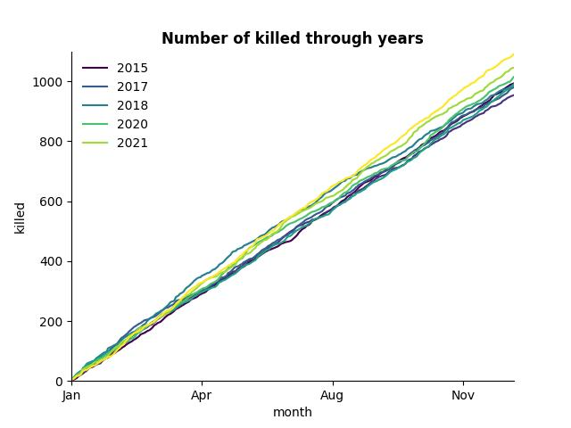
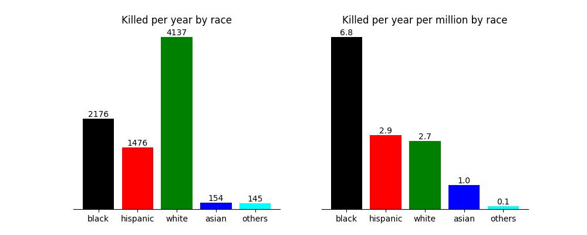
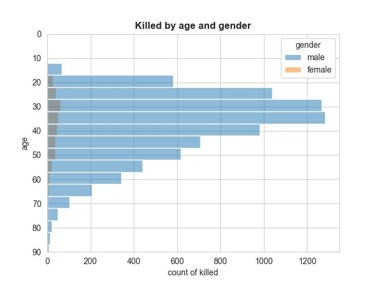
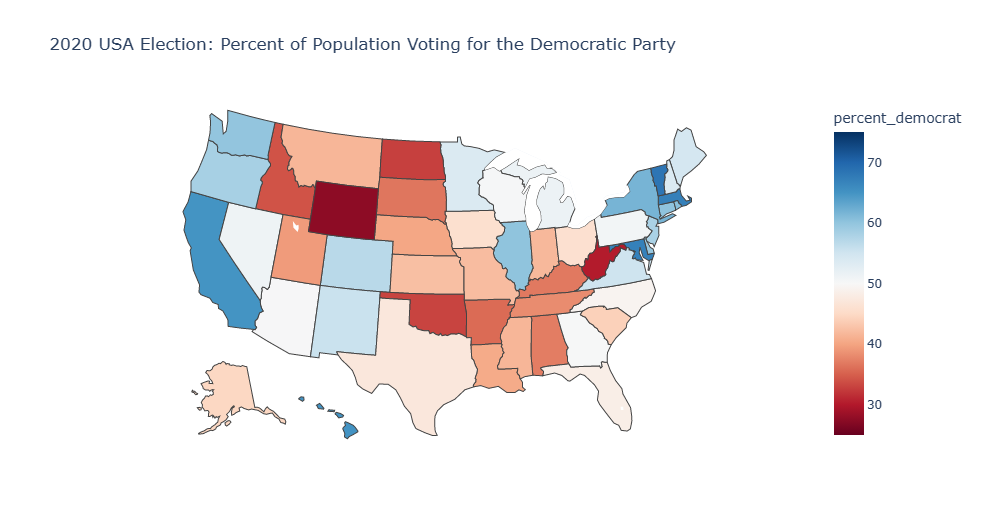
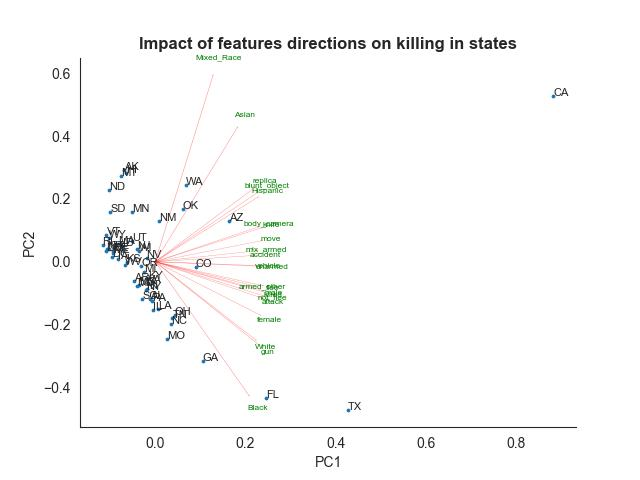

# Police Shootings in the United States 2015-2022

This notebook analyzes police fatal shootings in the USA and proposes solutions to this problem. The analysis is based on a dataset available at https://github.com/washingtonpost/data-police-shootings/tree/master/v2, which provides details on how the dataset was collected and updated.

The objectives of the notebook are to determine the most impactful features on police killings and propose solutions to this problem.

## Brutality Against Civilians
Every year, almost 3.5 people per million are killed by police. This is concerning mostly for Democrats, who want to keep officers accountable for their actions, while Republicans believe that the brutality is justified and rarely motivated by bias. The rate of police killings is slightly increasing.

## The Race Issue
The killings are racially disproportionate. Although white people are mostly affected, black people are killed more than twice as often.

## Young Men Are at the Highest Risk of Being Killed by Police

## Correlation Between Political Views and Number of Killings
States with more conservative views have more killings per year per million than those with more liberal views. This correlation is visible.

## Which Features Determine the Number of Killings the Most in Which State

The most crucial features in the number of killings vary per state. For California, societal minorities and objects imitating weapons are the most crucial features. In Texas, Florida, and Montana, many killings take place with the threat of guns, which are allowed in private firearm sales. Other features slightly affect police killings in some states.

## Solutions
The following solutions could help reduce police brutality and bias:
* Provide training for police to deescalate situations
* Increase police accountability through public reports
* Launch campaigns to promote inclusion of minorities and narrow gaps
* Utilize technology
* Reconsider changes to firearm laws.

## Installation
To run the code, copy the whole content of the repository to your local machine. The necessary libraries to run the code are: pandas, numpy, pandera, matplotlib, seaborn, plotly, scikit-learn, and scipy.

## License
MIT
